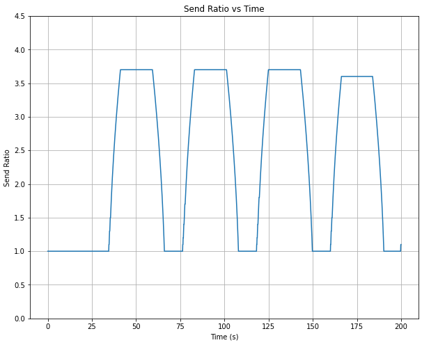

## Laboratorio 3 - Control de flujo y congestion
#### Francisco Cecchi, Juan Crúz González, Agustin Rodrigo Quevedo

## Optimización de Redes: Control Dinámico del Ratio de Transferencia para Gestión de Flujo y Congestión en redes simuladas en Omnet++

## Abstract
En el presente informe se detalla tanto el diseño como la implementación de un algoritmo de control de flujo y congestión dinámico, que a través de la modulación de su tasa de transferencia adecua su capacidad de envío al permitido por una red dada, así evitando saturar los buffers intermedios, tanto de red como de destino. Para desarrollar el presente informe utilizamos la herramienta de simulación Omnet++, cuyo lenguaje de programación es C++. Analizaremos los datos obtenidos con esta herramienta para desarrollar gráficos que informen cómo se comporta la red en distintas hipótesis de tasa de transferencia. También compararemos nuestro algoritmo con el funcionamiento de una red que no utilice mecanismos de control de flujo y congestión. Luego, explicaremos en detalle el funcionamiento del algoritmo propuesto y cómo resuelve los problemas encontrados. Finalmente haremos algunas críticas al algoritmo propuesto, y evaluaremos sus ventajas y desventajas. Para finalizar el informe, detallaremos sobre la utilización de Inteligencia Artificial en el presente proyecto.

## Introducción
### Problemas de flujo y congestión
Al diseñar una red de computadoras se distribuyen en 5 capas las problematicas que puedan surgir. En el caso del presente informe nos enfocaremos en la capa de transporte, donde encontramos un problema central a resolver a la hora de diseñar efectivamente una red de computadoras: la saturacion de buffers. Pueden surgir dos tipos de saturaciones:
- Saturación de buffers intermedios
- Saturación de buffers de receptor.

Denominamos a los algoritmos que controlan los buffers intermedios, es decir, de una subred, como de *Control de congestion*. Luego, nombramos a los algoritmos que controlan los buffers de receptor como de *Control de flujo*.

Estos problemas suelen surgir cuando un emisor rápido sobrecarga a un buffer más lento, llevando asi a que este tenga que eliminar paquetes

***Figura 1. Paquetes en el buffer de queue; Paquetes perdidos en el buffer de queue*** 

Se puede observar claramente como al saturarse el buffer de la subred (problema de congestión), alrededor de los 40 segundos de simulación, se empiezan a perder paquetes linealmente hasta el final de la simulación.

La severidad de perder paquetes dependerá exclusivamente del uso que la capa de aplicación le de a los datos más recientes. En algunos casos, la importancia puede ser menor, como en el caso de aplicaciones que manejen informacion en tiempo real, donde el paquete mas nuevo sera el más relevante, pudiendo asi descartar paquetes viejos sin mucho problema. Pero en el caso de otras aplicaciones, la perdida de paquetes es un problema más importante, ya que implicaría señales de retransmision de los paquetes perdidos, lo que podria afectar significativamente el rendimiento de la red.

### Metodología de trabajo: Simulación discreta

Este proyecto fue realizado utilizando la herramienta OMNeT++. La misma es un entorno de simulación modular y extensible que nos permite modelar y simular sistemas de comunicación, redes de computadoras, protocolos de red, arquitecturas de computadoras y otros sistemas complejos. El nombre "OMNeT++" proviene de "Objective Modular Network Testbed in C++".

OMNeT++ proporciona un marco de trabajo flexible y poderoso para la construcción de modelos de simulación. Está escrito en C++ y utiliza un paradigma de programación orientada a objetos. Utilizaremos esta herramienta para modelizar los problemas de flujo y congestión.

### Modelación
A modo de comparación con el algoritmo propuesto posteriormente, desarrollamos una red sencilla que sufra de flujo en un caso, y congestión en otro.
Esta red cuenta con 3 modulos:

- **NodeTx**: Módulo con un generador de paquetes denomidado *Generator*, conectado a un *buffer*. El buffer del nodo generador suele tener un tamaño arbitrariamente alto, ya que el transmisor tiene en su memoria el contenido a transmitir, por lo que no resulta limitante el tamaño de este buffer especifico.
 Este modulo conectará su output a un input de un modulo *queue*.

- **Queue**: Simula un nodo de sub-red entre el transmisor y el receptor. Este modulo cuenta con un buffer de 200 paquetes. Se encarga de recibir el paquete del transmisor (NodeTx) y enviarlo al receptor (NodeRx). Este modulo tardara un tiempo *n* en procesar el paquete. En el caso que el nodo transmisor (NodeTx) envie paquetes a mayor velocidad que el nodo *queue* pueda procesarlos y enviarlos, su buffer se comenzara a llenar. Como su espacio es limitado (200 paquetes), tras *s* segundos el buffer se llenara, y no tendra otra opción que descartar paquetes, es decir, problema de congestión (figura 1). 

- **NodeRx**: Nodo que contiene un *buffer* de 200 paquetes y un *sink*. Se encarga de recibir el paquete del *queue* y enviarlo al *sink*, donde es destruido. Simula el transpaso de un paquete de la capa de transporte a la capa de aplicación. El **buffer** tarda *k* segundos en procesar el paquete, por lo que si un emisor rapido, en conjunto a una red de su misma capacidad entregan paquetes a una velocidad mayor a las que el receptor puede procesarlos, el buffer se llenara, generando problemas de flujo.

### Análisis por casos: Congestión y Flujo

Para poder análizar ambas problematicas, hemos realizado 2 casos que nos permitan enfrentarnos a problemas tanto de congestión como de flujo.

#### Caso 1: Flujo
Para simular una red con problemas de flujo establecimos los siguientes parámetros
- **NodeTx a Queue:** datarate 1 Mpbs y delay = 100 us
- **Queue a NodeRx:** datarate 1 Mpbs y delay = 100 us
- **NodeRx a Sink:** datarate 0.5 Mpbs y delay = 100 us
- **Generación:** 10 paquetes por segundo
- **Tamaño de paquete:** 12500 Bytes
- **Tiempo de simulación:** 200 segundos

Al simular esta red vimos como el buffer del nodo **Queue** no tenía problemas para soportar la carga del transmisor (NodeTx) y enviar el paquete antes que llegue otro, solamente utilizando 1/200 paquetes disponibles a almacenar en su buffer.

***Figura 2. Paquetes en el buffer de queue*** 

Sin embargo, como la tasa de envios de paquetes del buffer de *Queue* a *NodeRx* es superior a la tasa de envío de *NodeRx* a *Sink*, el buffer de este nodo comenzó a llenarse rapidamente, hasta que aproximadamente al segundo 40 de simulación el buffer estaba lleno, por lo que comenzó a rechazar (perder) paquetes.

***Figura 3. Cantidad de paquetes en el buffer de NodeRx*** 

***Figura 4. Cantidad de paquetes rechazados en el buffer de NodeRx*** 

#### Caso 2: Congestión

Para simular una red con problemas de congestión establecimos los siguientes parámetros:
- **NodeTx a Queue:** datarate 1 Mpbs y delay = 100 us
- **Queue a NodeRx:** datarate 0.5 Mpbs y delay = 100 us
- **NodeRx a Sink:** datarate 1 Mpbs y delay = 100 us
- **Generación:** 10 paquetes por segundo
- **Tamaño de paquete:** 12500 Bytes
- **Tiempo de simulación:** 200 segundos

En este caso la transmisión de *NodeRx* a *Sink* es mayor, pero la transmisión de *Queue* a *NodeRx* es menor que en el caso 1 (0.5 Mbps)

Este caso es el de la figura 1;

***Figura 1. Paquetes en el buffer de queue; Paquetes perdidos en el buffer de queue***

Vemos que alrededor del segundo 40 el buffer se llena y comienza a eliminar paquetes rápidamente. Generando problemas de congestión.

Sin embargo, en este caso vemos el buffer de *NodeRx* semivacío, con solo 1 paquete.

***Figura 5. Cantidad de paquetes en el buffer de NodeRx*** 

### Conclusiones

#### Retraso de entrega
Si bien en el caso 1 y en el caso 2 surgian problemas en distintos nodos de la red, ya sea en la sub-red o en el receptor, encontramos que ambos casos sufrían de un retraso de entrega de paquetes a Sink igual. Es decir, el tiempo de entrega fue igual en ambos casos, por lo tanto concluimos que no es relevante donde ocurra la saturación de los buffers de una red, y que por lo tanto es necesario un algoritmo que regule su tasa de transferencia para adecuarse al buffer con menor capacidad de una red.

***Figura 6. Retraso de entrega de paquetes a Sink***

#### Caudal Útil vs Carga ofrecida

En el siguiente gráfico observamos una comparativa, entre; el *caudal útil*, es decir, los paquetes por segundo que recibe el receptor; y la *carga ofrecida*, es decir la cantidad de paquetes por segundos que envia el generador.
    Sobre el eje de Carga ofrecida se grafica la situación para distintos **GenerationInterval**, que es la cantidad que paquetes generados por segundo. La linea guionada roja es el caso ideal, que sube linealmente con el tiempo, hasta que llega al limite de la red, en este caso 5 paquetes por segundo. Tras analizar el gráfico concluimos que existe un punto, alrededor de los 4 y 6 paquetes por segundo, donde la red comienza a saturar los buffers, generando problemas (obtuvimos los mismos datos para el caso 1 y el caso 2), y haciendo que la red funcione por debajo de su capacidad máxima.

***Figura 7. Caudal Útil vs Carga ofrecida***

## Modelos

### Algoritmo de Control Dinámico del Ratio de Transferencia

### Idea de implementación
En base a lo concluido a través del analisis del caso uno y el caso dos decidimos implementar un algoritmo que dinámicamente cambie la tasa de transferencia desde el buffer del generador ya que conocemos la capacidad de este, la cual es lo suficientemente grande para poder almacenar todos los paquetes que no puedan ser enviados. Decidimos que el indicador para reducir la tasa de transferencia de paquetes sería un mensaje por parte de los buffers que se quedan sin espacio, en cada "iteración" los mismos evaluaron la capacidad restante e informaron que se están llenando en caso de que dicha capacidad sea menor al 20%.
Para no reducir la tasa más de lo necesario por cada mensaje proveniente de los buffers  decidimos decrementar la tasa un poco, aumentando el retardo en enviar un paquete. Esto se realiza continuamente hasta que los mensajes dejen de llegar, decrementando la tasa de envío solo lo necesario. A su vez para evitar que la red desperdicie recursos cuando ya se alivio la congestión o no hay más problemas de flujo tomamos la decisión de mantener la tasa de envio baja durante un periodo arbitrario de 50 paquetes, dándole tiempo a los buffers de vaciarse y luego incrementarla en cada nuevo envío proporcionalmente a como la incrementamos en un principio hasta alcanzar la tasa original.
En cuanto a que buffer se está quedando sin espacio no lo tenemos en cuenta, ya que disminuir la tasa desde el buffer del generador afecta a toda la red. Con esto cuenta si un módulo recibe un mensaje de feedback tan sólo lo reenvía para que finalmente llegue al nodo TransportTx el cual se encarga de regular la tasa.
Para implementar esto seguimos la idea mostrada por la imagen dada por la catedra en la consigna, utilizando como canal de vuelta para los feedback packets un modulo Queue1.
Nuestro objetivo con esta implementación era evitar la pérdida de paquetes que vimos presente en el caso uno y en el caso dos, la cual se daba en diferentes puntos de la red pero con similar resultado.

### Hipótesis
En base a lo que implementamos supusimos que no iba a haber pérdida de paquetes ya que se enviaron cada vez menos antes de que se llenaran los buffers. Esto impediría el dropeo de paquetes a costa de un mayor delay de entrega, ya que para no perderse los paquetes deberían estar más tiempo en espera en el buffer del generador.

## Resultados

#### Control de flujo
Observamos que al implentar nuestro algortimo el buffer del receptor nunca se llena, ya que al alcanzar el 80% de ocupacion y comienza a enviar paquetes de feedback al generador para que disminuya su tasa de transferencia. Comparado con figura 3, nuestro algoritmo logra que el buffer no tenga que perder paquetes al llenarse.

***Figura 8. Tamaño de buffer de Rx con algoritmo propuesto***

#### Control de congestion
Similar al caso anterior, el buffer de Queue no se llega a llenar nunca, ya que al romper el limite del 80% de ocupación llega a enviar los paquetes de feedback para reducir la tasa de envio del generador

***Figura 9. Tamaño de buffer de queue con algoritmo propuesto***

### Análisis de resultados
Luego de implementar nuestro algoritmo y correr la simulación con los parámetros del caso uno y del caso dos comprobamos nuestra hipótesis con los resultados obtenidos. En las condiciones dadas por los parámetros de simulación los buffers no se llenan al máximo, por lo que el umbral de aviso para la disminución de la tasa de envió fue el correcto (avisar el tamaño de buffers pasado el 80% ocupado), es decir no hay pérdida de paquetes. Por otra parte anticipamos un aumento en el delay (figura 10) y en la cantidad de paquetes alojados en TransportTx al finalizar la ejecución (figura 11), es decir solo es posible por el tamaño que tiene el el módulo TransportTx, ya que si tuviera el mismo tamaño o similiar al de los demás buffers/queues habría pérdida de paquetes, en este caso todos los paquetes quese hubieran periddo quedan en este buffer. Además vimos que debido a la disminución de la tasa de envío se desaprovecha un poco la capacidad de la red. Concluimos que nuestro algoritmo funciona con los parámetros dados bien pero es un trade-off entre no perder paquetes pero tener más delay y perder un poco de eficiencia al no poder usar la máxima capacidad de la red en todo momento, como se evidencia en la tasa de transferencia (figura 12). En respuesta a la pregunta planteada en la consigna, nuestro algoritmo se comporta de igualmanera frente a la congesdtion que se da en el caso uno y en el caso dos, en ambos toma la misma medida de disminuir la tasa de envio hasta que no haya más problema de congestion, sea en el modulo que sea. 

***Figura 10. Delay de entrega de paquetes***

***Figura 11. Cantidad de paquetes en el buffer de Tx***

***Figura 12. Multiplicador de tasa de transferencia.***

**Figura 13. Caudal útil vs Caudal ofrecido**
## Discusión

### Posibles mejoras
Como hemos dicho, disminuimos muchísimo la pérdida de paquetes (ya que fue nuestra prioridad) pero sacrificamos un poco del tiempo de máxima productividad. Nuestro algoritmo está inspirado por la idea de **arranque lento**, pero no nos convencía la idea de disminuir gran parte del envío, ya que se perdería aún más el tiempo de máxima productividad, así que nos pareció mejor que se haga progresivamente. Esto es claramente mejorable, nosotros elegimos los valores usando como base la información obtenida de los buffers, esto quiere decir que en redes con distintas capacidades no funcionan exactamente igual, para solucionarlo se debería encontrar una fórmula parametrizable para definir dichos valores, es decir teniendo en cuenta la tasa de envío de paquetes, las capacidades de los buffers y demás aspectos de la red calcular a qué porcentaje de uso del buffer este debe avisar que se debe reducir la tasa de envío y también debe decidirse que tanto de disminuye esta. Otra cosa que podría mejorarse sería incluir información redundante al estado de los nodos en los paquetes de feedback para usarla al momento de calcular la tasa de transferencia, en nuestro algoritmo nosotros usamos principalmente el hecho de que llega un mensaje de feedback para solucionar el problema, no su contenido en sí.

## Uso de inteligencia artificial  
Las principales herramientas que utilizamos fueron **Copilot** y **Chat GPT**, en el caso de ambos los utilizamos para consultas sobre la sintaxis y cómo trabajar con objetos, ya que ningún miembro tenía experiencia en este paradigma de programación. Así como para consultas sobre el funcionamiento de **omnet**, sobre la interfaz, la semántica, la forma de realizar conexiones entre módulos y sobre funcionalidades que provee, por ejemplo una consulta fue las diferencias entre los msg y los cPacket. 

## Referencias.
+ Duran, Juan. Filminas *Capa de Transporte: Control de Flujo* y *Control de congestión*
+ Tanenbaum, A. S., & Wetherall, D. J. (2011). *Redes de computadoras* (5ª ed.). Pearson Educación.
