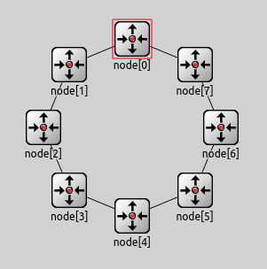
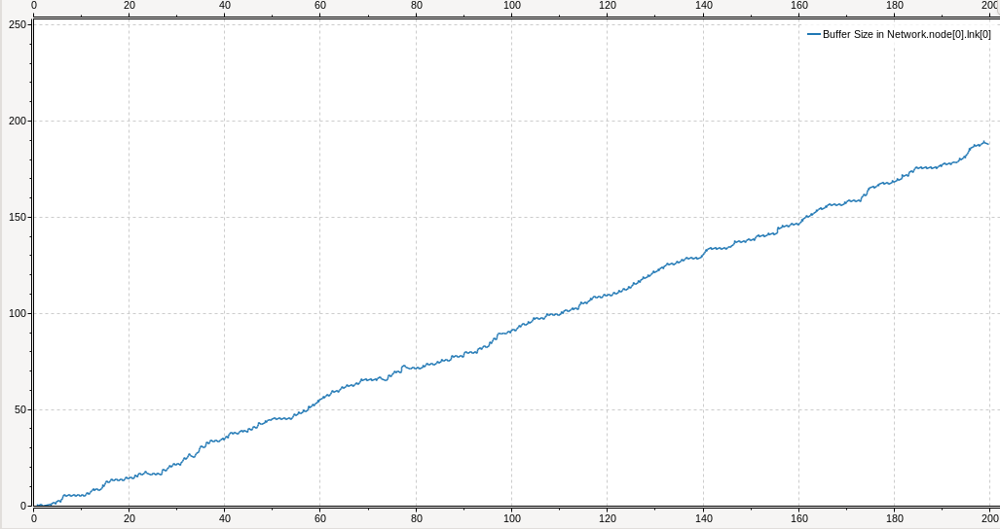
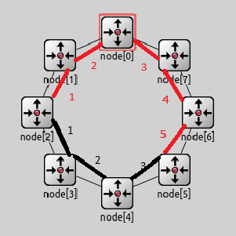
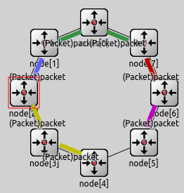
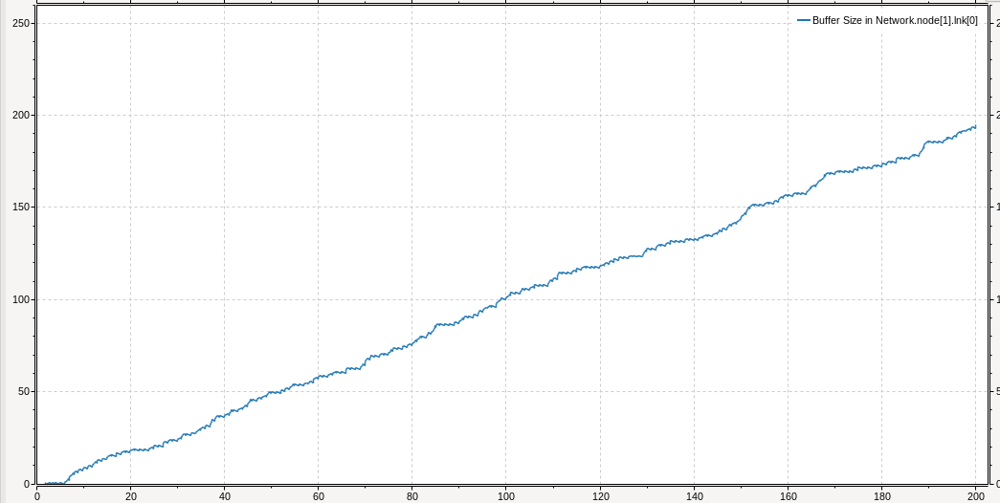
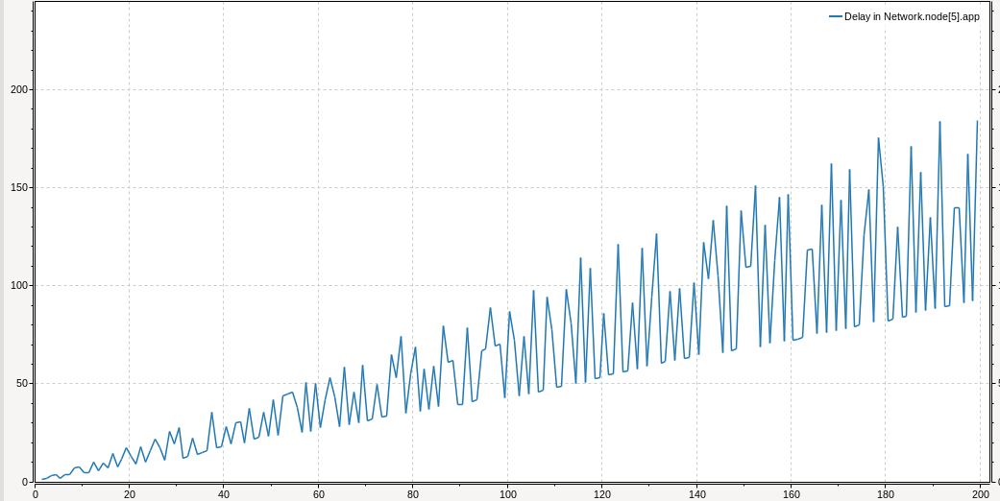
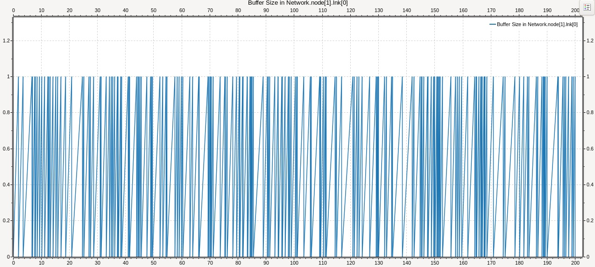
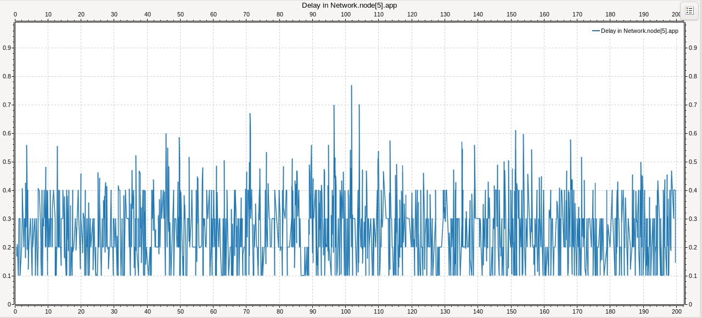
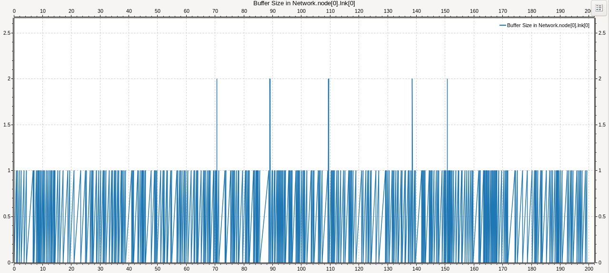

## Laboratorio 04 - Capa de red: Enrutamiento
#### Francisco Cecchi, Juan Crúz González, Agustin Rodrigo Quevedo
## Implementación de un Algoritmo de Enrutamiento Óptimo de Capa de Red, en redes simuladas en Omnet++
## Abstract
    En el presente informe propondremos el diseño y la implementación de un algoritmo de enrutamiento. El algoritmo está desarrollado sobre la capa de red, es decir, que se ejecuta en los enrutadores de una sub-red y el fin del mismo es entregar un paquete desde un enrutador origen a un enrutador destino a través de un camino óptimo, siempre que sea posible. El algoritmo se desarrolló utilizando Omnet++, escrito en C++. Esta herramienta nos permite simular redes y recolectar datos útiles sobre la red. Compararemos el funcionamiento de la red con nuestro algoritmo al funcionamiento de esta sin un algoritmo de enrutamiento óptimo.

## Introducción
### Redes sin Algoritmos de Enrutamiento Óptimo
    Las redes sin algoritmos de enrutamiento óptimo optan por soluciones simples: propagar el paquete por toda la subred hasta que llegue a su destino. Este enfoque, conocido como flooding o inundación, aunque garantiza la entrega del paquete, no es eficiente en términos de utilización del ancho de banda y puede generar congestión en la red. El objetivo principal de este proyecto es demostrar cómo un algoritmo de enrutamiento óptimo puede mejorar significativamente el rendimiento de la red. En el caso de la red que simulamos nosotros, al ser una red "anillo", es decir que todas los destinos estan conectados en forma circular, se opta por un metodo aún más sencillo: Enviar el paquete hacia el enrutador en sentido horario hasta que eventualmente llegue a destino.

Red anillo
### Enfoque de enviar paquetes en sentido horario en redes tipo anillo
    Este algoritmo, si bien es sencillo y facil de implementar, no es eficiente en términos de rendimiento, ya que por ejemplo si maquina 0 quiere enviar un paquete a maquina 7, en una red de 8 enrutadores, tiene que hacer el camino entero, 0 -> 1 -> 2 -> .. -> 6 -> 7. Sin embargo esta red soporta enviar paquetes en ambas direcciones, es decir se puede enviar un paquete de maquina 0 a maquina 7 y desde maquina 7 a maquina 0 directamente.

### Métodos
    Dividimos el analisis del caso de red sin algoritmo de enrutamiento optimo en 2. EN el primer caso, el nodo 0 y el nodo 2 mandan paquetes al nodo 5. En el segundo caso, todos los nodos mandan paquetes al nodo 5.

### Resultados
#### Caso 1
    En el primer caso observamos que el flujo hacia el buffer del nodo 0 era más del que podia soportar, ya que tenia que soportar con su propio flujo, y el del nodo 2, que en camino a nodo 5 pasaba por este. Por esto, a medida que avanzo la simulacion, este se fue llenando. Si bien en la simulación no tuvo que perder paquetes, si esta hubiera corrido más tiempo, se hubiera llenado.

Buffer Nodo 0; Eje X: Tiempo de simulación (s). Eje Y: Paquetes en buffer

    En el caso del Nodo 2 -> Nodo 5, observamos que el trafico proveniente de este no sigue un camino óptimo, ya que su recorrido es 2 -> 1 -> 0 -> 7 -> 6 -> 5.
    El camino optimo seria 2 -> 3 -> 4 -> 5.

Camino optimo (Negro), Camino realizado (Rojo)

    En el caso de Nodo 0 a Nodo 5, este elije la mejor ruta posible.
    El delay de entrega en este caso no fue un problema, ya que observamos que crecio linealmente con el tiempo.

#### Caso 2
    En este caso todos los nodos entregan paquetes al nodo 5

    Observamos que todos los nodos se comenzaron a llenar linealmente, poniendo bastante estres en la sub-red. Notamos que todos los buferes se encontraban una situacion similar a la siguiente. De seguir la simulación, seguramente todos los bufferes de la red se llenen, causando graves problemas de congestión.

Buffer nodo 1. Eje x: Tiempo de simulación (s). Eje y: Paquetes en buffer

    Observamos que los unicos nodos que consiguen ruta optima son el 1, 0, 7 y 6. Los demas toman una ruta sub optima. Sin embargo con este metodo consiguen llegar a destino

    Finalmente observamos que el delay de entrega de paquetes se comportó de manera irregular, con intervalos de gran delay, y una clara tendencia alcista

Delay de entrega. Eje x: Tiempo de simulación (s). Eje y: Tiempo de entrega (s)

### Conclusiones
    La implementación de un algoritmo de enrutamiento eficiente es fundamental para evitar problemas de congestión en la red. En el primer caso, el nodo 0 experimentó una carga excesiva debido a la ruta subóptima del nodo 2 al nodo 5, lo que podría haber llevado a la pérdida de paquetes si la simulación hubiera continuado. En el segundo caso, la entrega de paquetes al nodo 5 sobrecargó la red, llenando los buffers de varios nodos y causando grandes retrasos en la entrega.

    Solo algunos nodos lograron rutas óptimas, mientras que otros siguieron rutas subóptimas, aumentando la congestión y el tiempo de entrega de los paquetes. El delay de entrega mostró una tendencia alcista y comportamiento irregular, reflejando la ineficiencia de la red bajo carga.

    Para mejorar el rendimiento y la eficiencia de la red, es crucial implementar algoritmos de enrutamiento que dinamicen las rutas basándose en la carga actual y establecer mecanismos de monitoreo continuo de la carga de los nodos. Esto permitirá detectar problemas de congestión antes de que se vuelvan críticos.

## Diseño del Algoritmo
### Descripción del Algoritmo de Enrutamiento Óptimo
    El algoritmo de enrutamiento óptimo diseñado para este proyecto se inspira en el algoritmo de Dijkstra, que encuentra el camino más corto desde un nodo fuente a un nodo destino en un grafo ponderado. En nuestro caso, los nodos representan enrutadores y los enlaces entre ellos tienen asignados costos que pueden representar diferentes métricas, en nuestro caso, numero de saltos. Al inicializar un nodo de capa de red, este envia un paquete "hello" por cada linea disponible, en el caso de red "anillo", un paquete a la izquierda y otro a la derecha. Luego cuando llega a cada nodo, este paquete loguea en una lista en que nodo esta, cuantos saltos le costo llegar ahi y por que linea salió, tras esto es reenviado al nodo siguiente. En el caso de la red "anillo" eventualmente un paquete va a regresar al nodo que lo creo. Cuando esto sucede, registra en una lista el ID, distancia y linea de salida. Si llega otro paquete "Hello" compara sus valores en la tabla del nodo, en caso que tengan una linea salida distinta a un nodo, y su contador de saltos sea menor, lo reemplaza por este nodo, asi eligiendo la mejor ruta para un paquete.

### Implementación en Omnet++
    Para la implementación del algoritmo, hemos utilizado el entorno de simulación Omnet++ y el lenguaje de programación C++. Los pasos principales para la implementación son los siguientes:

    - Modelado de la Red: Definimos en Omnet++ una red de topologia "anillo", es decir, que todos las nodos están conectadas en forma circular. Cada nodo esta compuesto de una aplicación que consume o genera paquetes, un nodo de capa de red, que procesa y decide que hacer con el paquete, y finalmente 2 buffers de entrada y salida, uno que va al nodo que estaria a su izquierda, y otro hacia su derecha.

    - Desarrollo del Algoritmo: Nuestro algoritmo se divide en dos partes: Al comenzar cada enrutador debe aprender la topología de la red, y crear un grafo de sus vecinos. Al ya tener el grafo, se procede a encontrar el camino más corto desde el enrutador origen hasta el enrutador destino, utilizando el algoritmo de Dijkstra.

    - Ejecución del Algoritmo: Durante la simulación, cada enrutador ejecuta un algoritmo inspirado en Dijkstra para determinar el camino óptimo para cada paquete que debe enviar. Los paquetes son entonces enrutados a través de la red siguiendo estos caminos óptimos.

## Resultados
### Comparación de Rendimiento
    Para evaluar la efectividad del algoritmo de enrutamiento óptimo, comparamos el rendimiento de la red con y sin el algoritmo. Se utilizaron las siguientes métricas:

    -Tiempo de Entrega de Paquetes: El tiempo total que tarda un paquete en llegar desde el origen hasta el destino.
    Uso del Ancho de Banda: La cantidad de ancho de banda utilizada en la red.
    -Congestión de la Red: La cantidad de paquetes en cola en los enrutadores.

    Observamos que el tiempo promedio de entrega (delay), oscila entre 0 y 0.4 segundos en promedio.

Buffer nodo 1. Eje x: Tiempo de simulación (s). Eje y: Paquetes en buffer
    Tambien observamos que el promedio de utilización de buffer es mínimo, oscilando entre 0 y 1.

Delay de entrega. Eje x: Tiempo de simulación (s). Eje y: Tiempo de entrega (s)

Buffer nodo 0. Eje x: Tiempo de simulación (s). Eje y: Paquetes en buffer
## Análisis de Resultados
    Los resultados de la simulación muestran una mejora significativa en el rendimiento de la red cuando se utiliza el algoritmo de enrutamiento óptimo. En particular, se observa una reducción en el tiempo de entrega de paquetes y en la congestión de la red, así como un uso más eficiente del ancho de banda.

## Conclusiones
    La implementación de un algoritmo de enrutamiento óptimo basado en el algoritmo de Dijkstra en una red simulada en Omnet++ demuestra una mejora significativa en el rendimiento de la red en comparación con una red sin un algoritmo de enrutamiento óptimo. Estos resultados destacan la importancia de utilizar algoritmos de enrutamiento avanzados para optimizar la entrega de paquetes y mejorar la eficiencia de la red.

## Trabajos Futuros
    Para continuar con este trabajo, se podrían explorar otros algoritmos de enrutamiento, como algoritmos basados en inteligencia artificial o aprendizaje automático, que podrían adaptarse dinámicamente a las condiciones cambiantes de la red. Además, sería interesante evaluar el impacto de diferentes métricas de costo en el rendimiento del algoritmo de enrutamiento.

### Referencias
    Tanenbaum, A. S., & Wetherall, D. J. (2011). Computer Networks (5th ed.). Pearson.
    Omnet++ Discrete Event Simulator. (n.d.). Retrieved from https://omnetpp.org/
